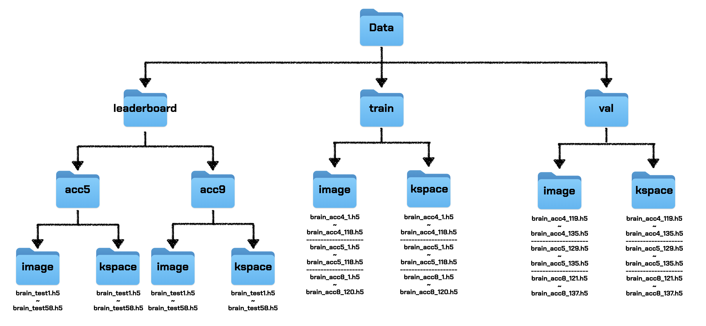

# Data Structure
Data in the remote GPU server is structured as so:



# What Are the Dependencies?
As of now, here is how to download the dependencies for FastMRI

```bash
pip3 install numpy
pip3 install h5py
pip3 install scikit-image
pip3 install torch
```

# How to run?
Running is divided into three steps: `train`, `reconstruct`, and `evaluate`. To do this we merely have to run the following commands
```bash
sh train.sh #for training
sh reconstruct.sh #for reconstruction
sh leaderboard_eval.sh #for evaluatoin
```