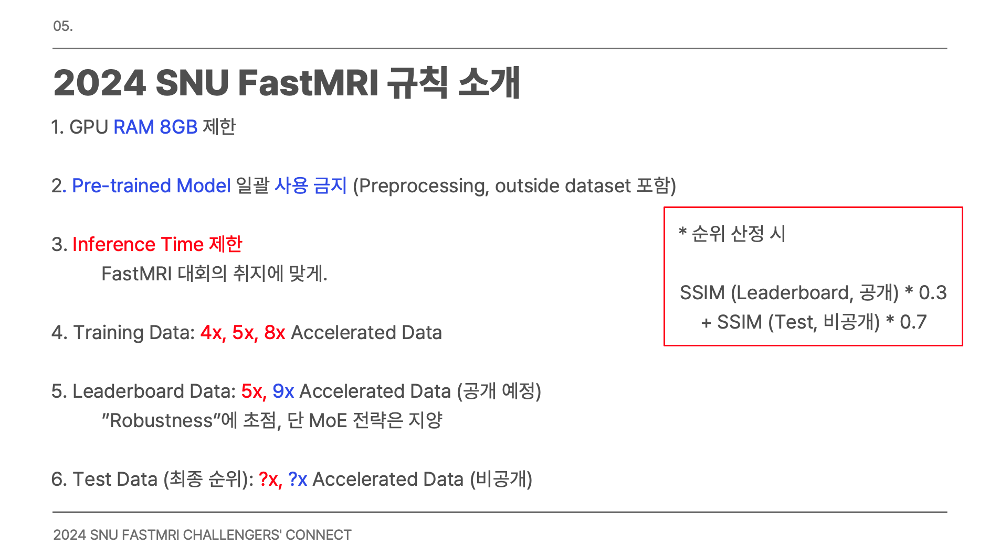

# Guidelines for Fast MRI

*Source: Emails from fastmri@gmail.com, Youtube at [Youtube](https://www.youtube.com/@SNUFastMRIChallenge), Github at [Github Repo](https://github.com/LISTatSNU/FastMRI_challenge)* 

보다 상세한 규칙에 대한 설명은 [Youtube](https://www.youtube.com/@SNUFastMRIChallenge) 에 올라와 있으니 참조하자.

현재 우리는 IABENG 80 GPU Node를 배정받은 상태이다. 

## How to get the Base Line Code
MRI Image 생성과 관련된 baseline으로 `u_net`과 `var_net`을 공유하였다. 이는 [Github Repo](https://github.com/LISTatSNU/FastMRI_challenge)에 공유되었다. 

해당 repository를 `clone`한 이후에 `git checkout 2024_baby_unet` (혹은 `git checkout 2024_baby_varnet`)을 한 이후에 `pip install scikit-image h5py`를 시행하자. 

## How to Validate Your Model

다음부터는 이후 모델을 제출할 때도 참조해야 하는 부분이니 유의하자. `baby_varnet` 혹은 `baby_unet`을 참조하는 것이 도움이 될 듯하다. 
- `train.py`를 참고한 이후 `train.sh`를 입력한 이후에 `seed`를 고정하여, `validation loss`를 제출하자. 
- 이후 `reconstruct.py`를 참조하여 `reconstruct.sh`를 시행한 이후에 `Total Reconstruction Time < 3000s`, `Success!`를 확인하자. 
- `leaderbord_eval.py`를 참조하여 `leaderboard_eval.sh`를 시행할 경우에 현재 `leaderboard`에 있는 `SSIM` 값을 확인하고, 우리 값이랑 비교하자. 

## Important Technical Issues in Deployment

중요한 issue가 2가지 보고되었다. 
- Train하여도 `cuda_out_of_memory`가 뜬다. 이는 권한 문제로 보인다. 
	- `nvidia_smi`를 시행하여 이를 확인하자. 
	- GPU restart를 하면 해당 issue가 사라진다는 보고도 있다. 
	- 이 이슈가 발생하면 [조교님](https://github.com/LISTatSNU/FastMRI_challenge/issues/238) 께 바로 보고드리자. 
- `Vessl`에서 Workspace를 생성할 때 `read-only`로 workspace를 시행하자. 
